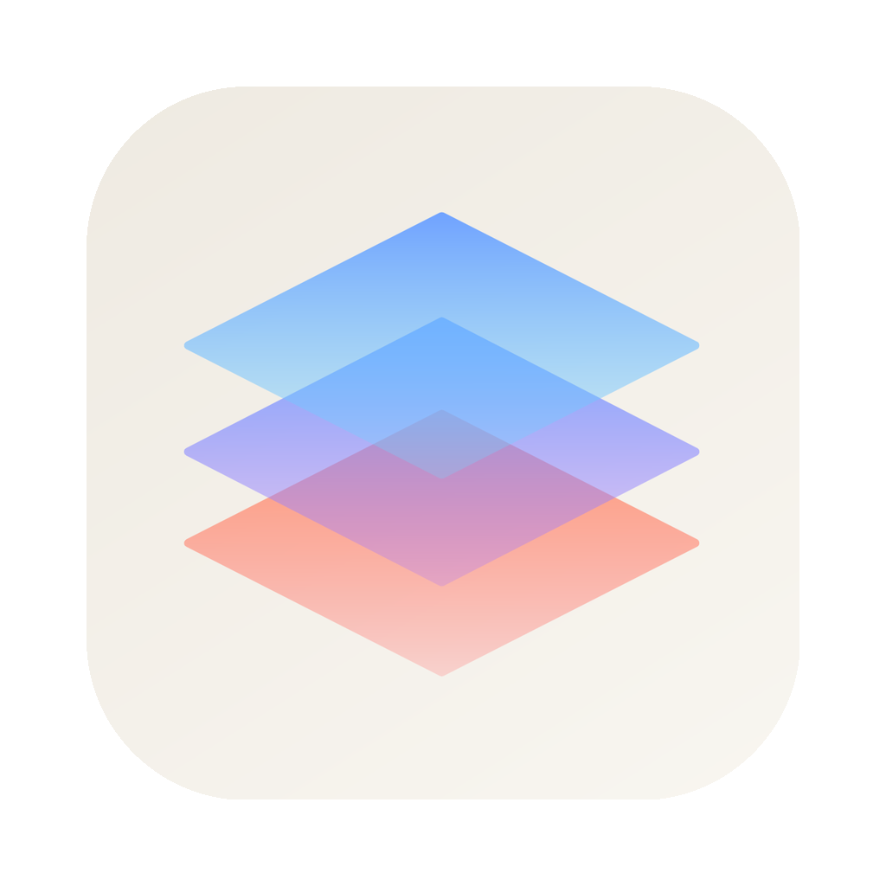
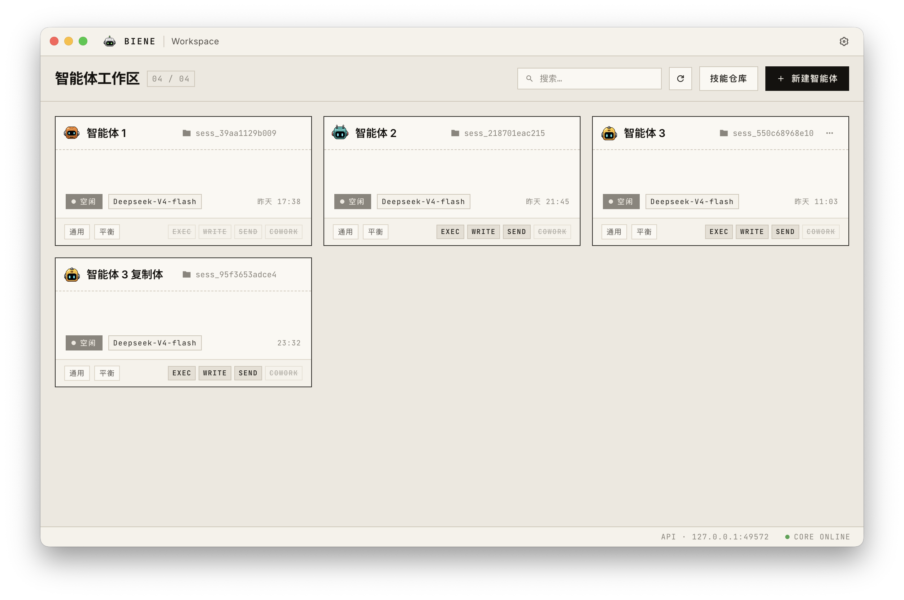

# Biene

<p align="center">
  
</p>

<p align="center">
  本地优先的 AI 编程助手桌面应用 · Local-first AI coding assistant
</p>

<p align="center">
  
  
  
</p>

---

Biene 是一个桌面端的多智能体 AI 编程助手。把"和模型对话"、"在工作区改代码"、"灵活组装搭配多智能体"、"在多个 agent 之间分发任务"等环节做成一体的本地体验——没有云端会话，所有历史和配置都留在你机器上。

## 主要特性

- 🤖 **多智能体网格** — 同时运行多个 agent，每个有独立工作区、独立上下文，甚至独立的技能。
- 🔁 **Agent 间协作** — agent之间可进行交流或者发起协作，共同完成任务。
- 🔌 **多模型来源** —
  - Anthropic API（Claude）
  - 任何 OpenAI 兼容端点（DeepSeek、Qwen、Kimi、自部署 …）
  - ChatGPT OAuth
- 🖼️ **多工具支持** — 支持基本工具调用以及cowork和process等特殊工具。
- 🛡️ **权限审批** — 文件写入 / Bash 命令 / agent 协作都会申请权限。
- 🧠 **思考模式** — 支持 Anthropic thinking 与 OpenAI 推理 token 的可视化和透传。
- 📚 **技能（Skills）** — 拒绝一股脑塞入，从技能仓库灵活组装你的agent
- 💾 **本地持久化** — 每个 agent 一个独立目录，自由发挥。

## 截图

<p align="center">
  
</p>

## 下载

当前为早期测试阶段，请前往release仓库查看细节

[Releases →](https://github.com/shupianx/biene-ai/releases)

## 系统要求

- macOS 12+ 或 Windows 10+
- 至少一个可用的模型来源：Anthropic API key / OpenAI 兼容 API key / ChatGPT Plus 账号

## 配置

首次启动会在 `~/.biene/config.json` 生成模板。打开应用 → 设置（Settings）即可在 GUI 里管理：

- 多个命名模型配置（`provider` 取值：`anthropic` / `openai_compatible` / `chatgpt_official`）
- 默认模型
- Chatgpt Oauth
- 主题、语言（中 / 英 / 德）

## 开发起步

需要 Node.js（最新 LTS）+ Go（版本见 `core/go.mod`）。

```bash
npm install
npm install --prefix renderer
npm run dev      # 启动 Vite + Electron + go run core/
```

也可以单独跑：

```bash
# 只起 Core（Go HTTP 服务）
cd core && go run . --host 127.0.0.1 --port 8080 --workspace ../workspace

# 只起 Renderer（Vue 3 + Vite）
VITE_CORE_URL=http://127.0.0.1:8080 npm --prefix renderer run dev
```

## 项目结构

```
biene-ai/
├── core/           # Go HTTP 服务：智能体循环、工具执行、OAuth、持久化
├── electron/       # Electron 主进程 + preload 桥接
├── renderer/       # Vue 3 前端（聊天界面 / 网格 / 设置）
├── scripts/        # 构建 / 打包 / 发布脚本
├── build/          # 应用图标 + 截图等静态资源
└── AGENTS.md       # 给 AI 编程助手 + 人类贡献者读的项目指南
```


## 数据存放位置

| 内容 | 位置 |
|---|---|
| 用户配置 | `~/.biene/config.json` |
| ChatGPT OAuth 凭据 | `~/.biene/chatgpt_tokens.json`（0600）|
| 工作区（开发） | 仓库根目录 `workspace/` |
| 工作区（打包后） | Electron `userData` 下的 `workspace/` |
| 每个 agent | `<workspace>/<agent-id>/`（含 `meta.json` + `history.db` + agent 工作目录） |

## 致谢

- [Anthropic](https://www.anthropic.com/) / [OpenAI](https://openai.com/) — 模型供应方
- [Electron](https://www.electronjs.org/) / [Vue](https://vuejs.org/) / [Vite](https://vitejs.dev/)
- [openai-go](https://github.com/openai/openai-go) v3 SDK
